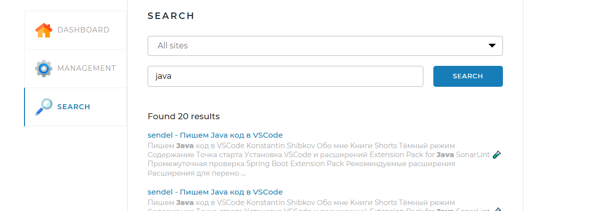

### Поисковый движок

1. В application.yaml установить нужные сайты для поиска
   например :
   indexing-settings:
   sites:

- url: https://url.ru
  name: url
- url 2
- name 2

2. У указать логин и пароль для доступа к БД    
   username: root
   password: root

3. Запустить приложение из класса SearchEngineApplication.java
4. осле запуска на вкладке management нажать start index
   
5. Когда все сайты проиндексированы, это видно на вкладке dashboard
   
6. После можно проводить поиск по ключевым словам на вкладке
   search
   

## Использованные технологии

-  Проект реализован на основе Spring Boot.
-  В качестве базы данных использована MySQL.
-  структура БД управляется с помощью liquibase.
- 
## Использование визуального интерфейса

1. Настройте параметры индексации и поиска через конфигурационный файл **application.yml** (не забудьте указатать логин
   и пароль базы данных).
2. Запустите программу.
3. В левой части панели перейдите во вкладку "**Managment**" и нажмите на кнопку "**Start indexing**".
4. После окончания процесса индексации статистическая информация станет доступна во вкладке "**Statistics**".
5. Для поиска используйте вкладку "**Search**", при использовании поиска есть возможность использовать органичение на
   поиск по одному сайту.

## API

### Индексация

Для индексации используйте следующие endpoint:

```html
GET /api/stopIndexing
```

```html
POST /api/indexPage/url:URL страницы для добавления в индекс
```

### Поиск

```html
GET /api/search?query=тело запроса&offset=0&limit=10&site=ограничение на поиск внутри определенного сайта
```

### Статистика

```html
GET /api/statistics
```

### Запуск
В файле конфигурации "application.yaml" указать логин и пароль от аккаунта MySQL и сайты, которые хотите индексировать.
